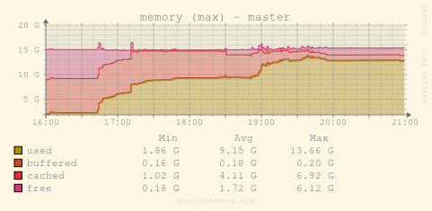
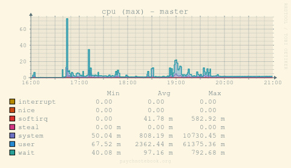
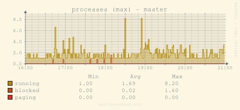
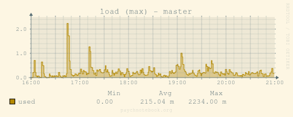
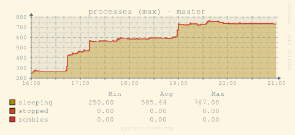
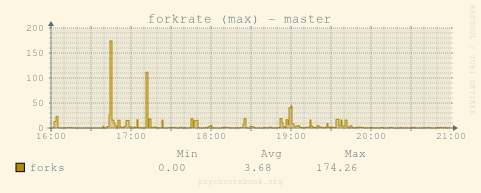
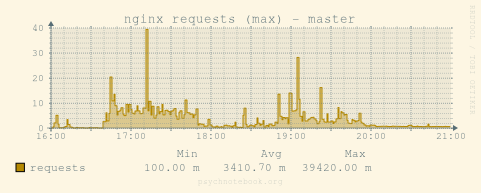
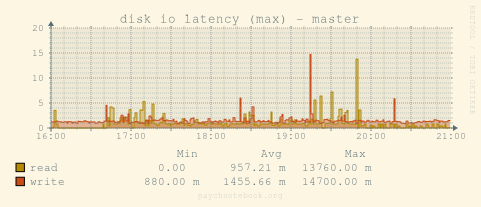
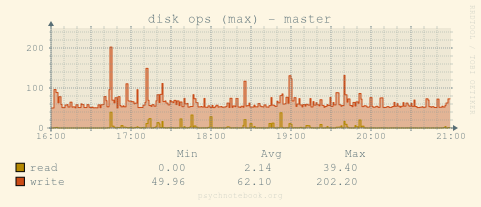
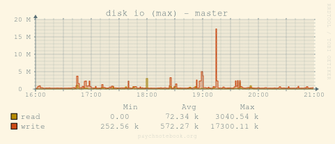

Performance
===========

A look into how we are doing regarding performance.

Evaluation 2020-04-21
---------------------

First session for Stefanie’s seminar, which started at 16:15 and ended at 17:45. 14 student
participants attended and used both JupyterLab and Rstudio.

Second session with Michael, started around 18:00 and ended around 20:00.

Events visible:

16:45
	Users starting JupyterLab at the same time clearly visible in fork rate.
	According to audit log 17 apps were started between 16:43:55 and 16:47:05.
	10 of them in 6 seconds.  Consuming ~9 GB of RAM. Little CPU usage.
17:12
	Another 13 instances of RStudio started between 17:12:13 and 17:12:35.
18:50–19:40
	18 workspaces created and 23 applications (mostly RStudio) started, 13 around 19:00
19:41
	A maximum number of 62 apps are running.
21:40–22:35
	A bunch of RStudio instances quit

Lessons learned:

- Memory limits number of applications/users
- 8 CPU cores are more than enough and disk I/O seems fine
- Limit number of applications running a) in total and/or b) by a user.
- Need data for network traffic, conductor and bawwab
- RStudio seems to time out on its own

